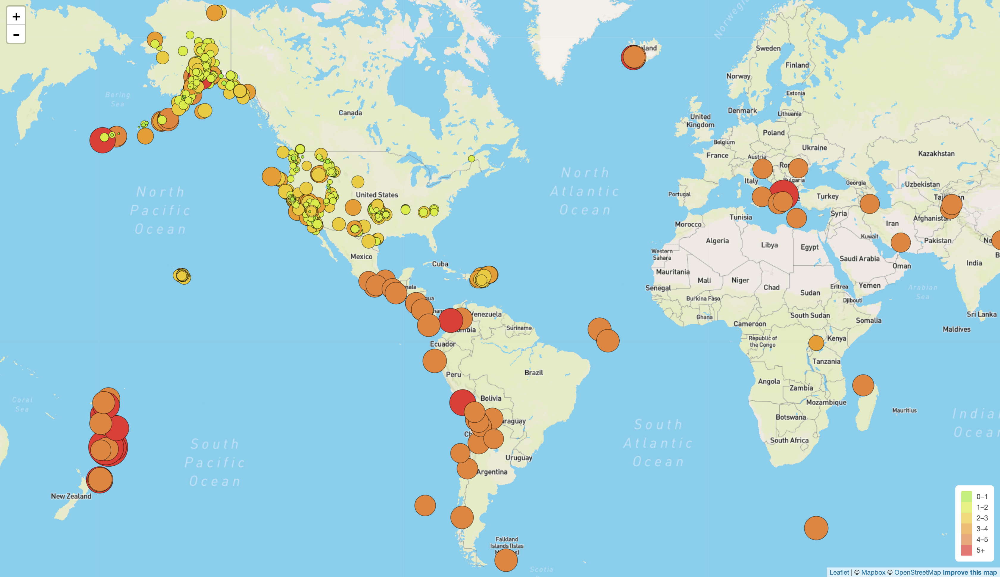

# USGS Earthquake Data Visualization with Leaflet

  

  <a href="https://kiranrangaraj.github.io/USGS-Earthquake-Data-Visualization/">Visit Website</a>

---

## Summary ##

The United States Geological Survey (USGS) is responsible for providing scientific data about natural hazards, the health of our ecosystems and environment, and the impacts of climate and land-use change. Their scientists develop new methods and tools to supply timely, relevant, and useful information about the Earth and its processes. One of the aspects the USGS focuses on is earthquakes, which they are continuously collecting data on from all over the world. 

In order to assist the USGS in understand and establishing trends from this data, this project visualized recent earthquakes (December 2020) upon a global map. The data set was obtained from the [USGS GeoJSON Feed](http://earthquake.usgs.gov/earthquakes/feed/v1.0/geojson.php), which updates every 5 minutes and provides earthquake data in a number of different formats. 

A JSON representation of the data appears once its link is clicked. For this project, the URL of the JSON was used to pull in the data for the visualization. An interactive global map with legend option (i.e. Satellite, Grayscale, Outdoors) filters was pulled from the Mapbox API. Leaflet.js was used to plot all of the earthquakes from the data set based on their longitude and latitude. Each earthquake differs in size and color based on the strength of its magnitude on the Richter scale. Earthquakes with higher magnitudes appear larger and darker in color. 

A second data set containing world tectonic plates was obtained from a [GitHub repository](https://github.com/fraxen/tectonicplates), then plotted on the map in order to illustrate the relationship between tectonic plates and seismic activity. By visualizing this data, the USGS would be able to better educate the public and other government organizations on planetary issues regarding seismic activity.

---

## Process ##

### Step 1: Basic Visualization

  

1. **Obtained the USGS GeoJSON data set**
2. **Imported and visualized the data**

   Created a map using Leaflet that plots all of the earthquakes from the data set based on their longitude and latitude.

   * Used data markers to reflect the magnitude of the earthquake in its size and color. 

   * Included popups that provide additional information about the earthquake when a marker is clicked.

   * Created a legend that will provide context for the map data.

### Step 2: Incorporating More Data

  

1. **Obtained a tectonic plate data set**
2. **Imported and visualized the data alongside of the original data**

   * Plotted a second data set on our map.

   * Added a number of base maps to choose from (Satellite, Grayscale, Outdoors), as well as separated the two different data sets into overlays that can be turned on and off independently.

   * Added layer controls to the map.

---

## Data Sources ##
* [USGS Earthquake GeoJSON Feed](http://earthquake.usgs.gov/earthquakes/feed/v1.0/geojson.php)
* [GitHub Tectonic Plates](https://github.com/fraxen/tectonicplates)

---

## Technologies Used ##
* HTML, CSS
* JavaScript, Leaflet.js
* Mapbox API

---

## Author ##
Kiran Rangaraj - LinkedIn: [@Kiran Rangaraj](https://www.linkedin.com/in/kiranrangaraj/)
